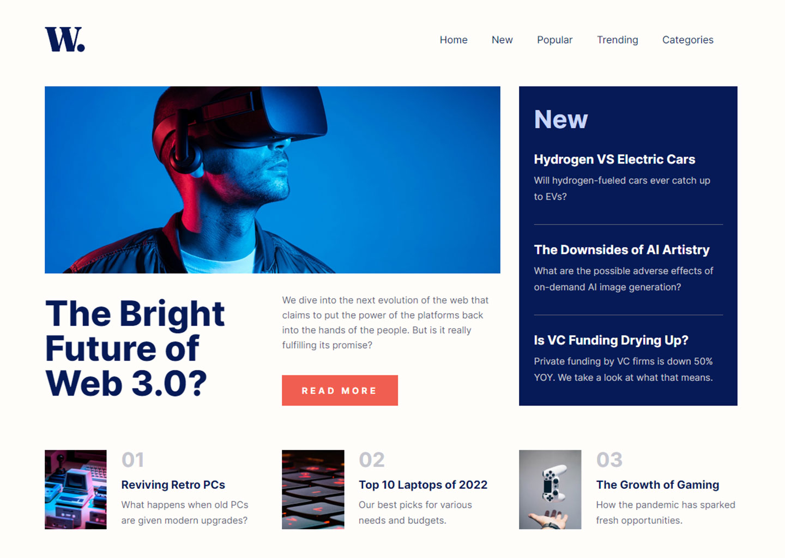

<h1>News homepage</h1>

  <h3>
    <a href="https://lighthearted-crumble-30d48f.netlify.app/"> Live View </a>
     | 
    <a href="https://www.frontendmentor.io/solutions/news-homepage-react-with-ts-95FhmSWQp9"> Solution Page </a>
  </h3>

  A challenge on Frontend Mentor.

## 👍 My Challenges:

- Custom components and Responsive navbar created.
- i tried to get all the data from a single json file.
- and worked for the good user experience.
- Getting high rate from [PageSpeed Insights](https://pagespeed.web.dev/analysis/https-lighthearted-crumble-30d48f-netlify-app/pclrhdjyg4?form_factor=mobile)

## 🎉 Build With:

- React + TypeScript
- Semantic HTML5 markup
- Css Grid
- Mobile-first workflow
- CSS custom properties
